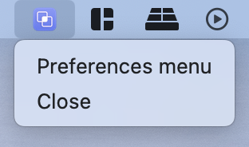
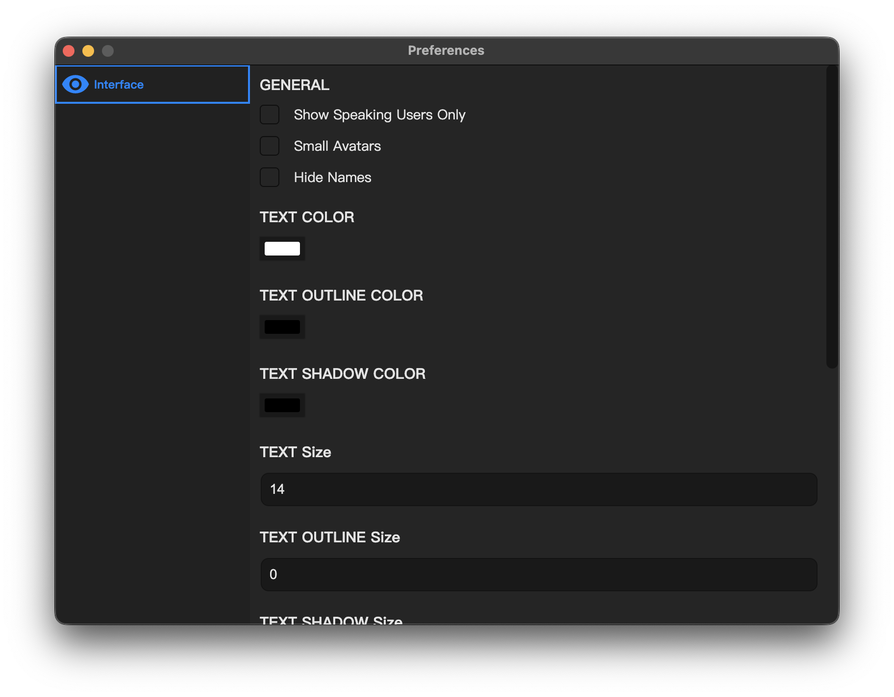

<h1 align="center">
  
   
  Remedy Pro
   
   
</h1>

# `Currently WIP`

# Usage  

## 1. Installation  

  

Download the .dmg from [release page](https://github.com/Naozumi520/discordOverlayMac/releases/edit/untagged-1f72c3ba8b82418ca30a), open the .dmg file and drag the `Remedy.app` to the Applications folder.  
  
## 2. Startup  

  

Double click "Remedy Pro" from your application list to open it. You should able to see the Remedy icon on the menu bar.     

## 4. Input your Discord Token  

  

To get your token, you can refer to [this document](https://github.com/aiko-chan-ai/discord.js-selfbot-v13#get-token-).  

## 5. Test  
Join a random channel. You should now see the overlay.  

# Questions

## How can I customize or quit the overlay?  

  
  

You can click the Remedy icon on the menu bar to see more options.

## Can overlay override a fullscreen app?  
Yes, Remedy overlay can override maximized and fullscreen apps.

## Can Remedy run automatically on macOS startup?  
Yes, you can do this using the macOS [Login Items feature](https://www.idownloadblog.com/2015/03/24/apps-launch-system-startup-mac/)