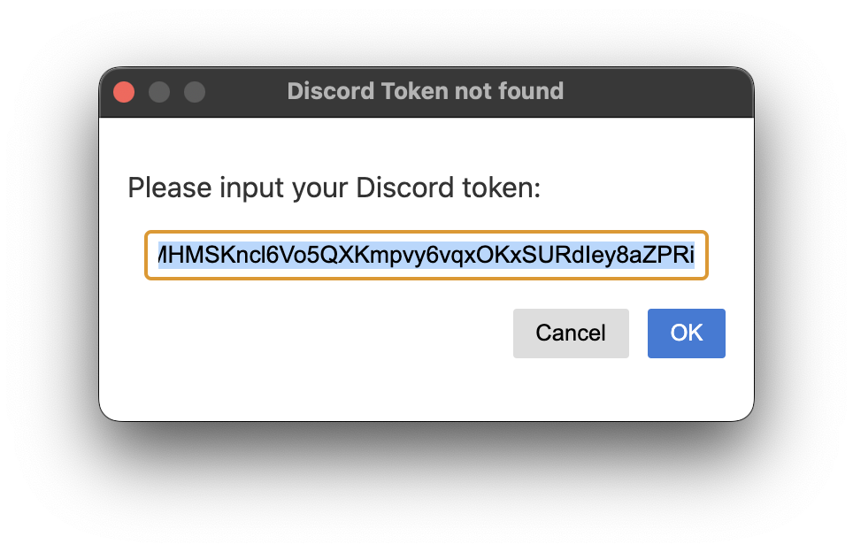

<h1 align="center">
  
   
  Remedy Pro
   
   
</h1>

# Usage  

## 1. Installation  

  

Download the .dmg from [release page](https://github.com/Naozumi520/Remedy/releases), open the .dmg file and drag the `Remedy Pro.app` to the Applications folder.  
  
## 2. Startup  

  

Double click "Remedy Standard" from your application list to open it. For some reasons this app is not signed yet. If you're not able to open the app, follow [this](https://support.apple.com/en-hk/guide/mac-help/mh40616/mac). If remedy run properly, you should able to see the Remedy icon appear in the menu bar.  

## 3. Log in to Remedy
Currently there are two ways to let you log in to remedy: QR Code and user token.
### QRcode: 

  

Open the discord app on your phone, go to the user page, press "Scan QR Code" button and scan the QR code provided by the remedy prompt.

### Token:

  

Click "login with user token" in the bottom right corner then enter your user token in the prompt.  

To get your token, you can refer to [this document](https://github.com/aiko-chan-ai/discord.js-selfbot-v13#get-token-).  

## 4. Test  
Join a random channel. You should now see the overlay.  

# Questions

## How can I customize or quit the overlay?  

  
  

After clicking the Remedy icon, there are few options in the menu bar:   
- `Preferences menu`:
  Open the overlay preferences menu, where you can adjust the overlays, such as text color and the size. The settings will be applied immediately.
- `Close`:
  To quit remedy.

## Can overlay override a fullscreen app?  
Yes, Remedy overlay can override maximized and fullscreen apps.  

## Can Remedy run automatically on macOS startup?  
Yes, simply turn on `Start at login` in Preferences

  

