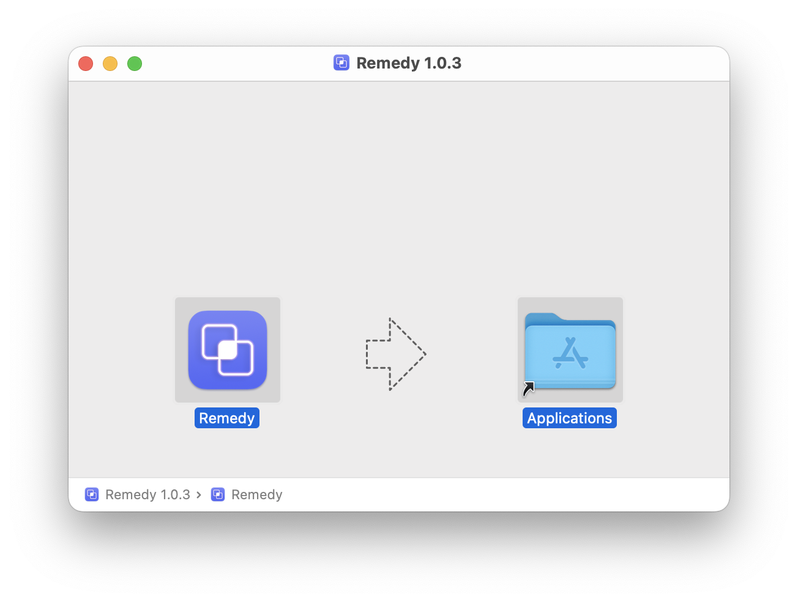
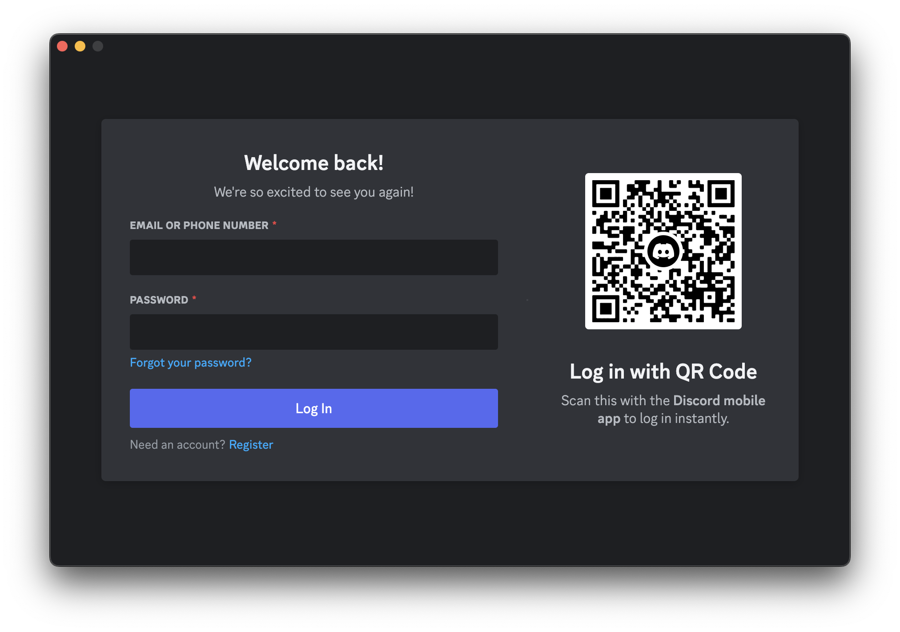
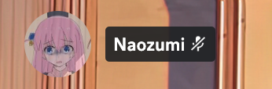
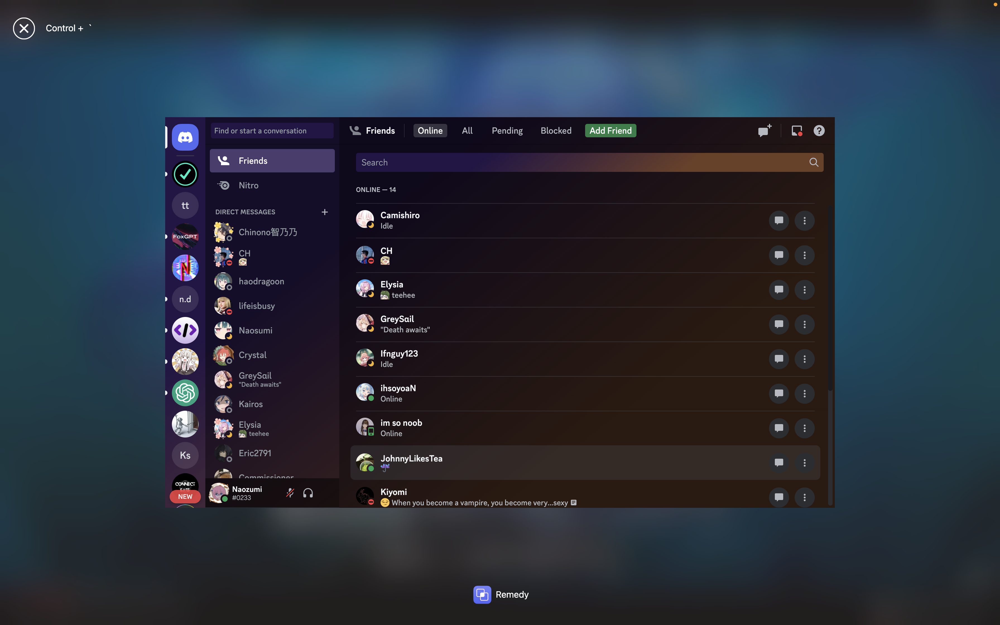
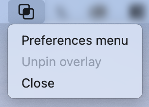

<h1 align="center">
  
   
  Remedy Pro
   
   
</h1>

# Usage  

## 1. Installation  

  

Download the .dmg from [release page](https://github.com/Naozumi520/Remedy/releases), open the .dmg file and drag the `Remedy Pro.app` to the Applications folder.  
  
## 2. Startup  

  

Double click "Remedy Standard" from your application list to open it. For some reasons this app is not signed yet. If you're not able to open the app, follow [this](https://support.apple.com/en-hk/guide/mac-help/mh40616/mac). If remedy run properly, you should able to see the Remedy icon appear in the menu bar.  

## 3. Log in to Remedy

  

## 4. Test  
Join a random channel. You should now see the overlay. Pressing control + ` should show the chat overlay.  

  
  

# Questions

## How can I customize or quit the overlay?  

  
  

After clicking the Remedy icon, there are few options in the menu bar:   
- `Preferences menu`:
  Open the overlay preferences menu, where you can adjust the overlays, such as text color and the size. The settings will be applied immediately.
- `Close`:
  To quit remedy.

## Can overlay override a fullscreen app?  
Yes, Remedy overlay can override maximized and fullscreen apps.  

## Can Remedy run automatically on macOS startup?  
Yes, simply turn on `Start at login` in Preferences.

  

## Why does Remedy have no icon on the dock?
Due to the overlay behavior under macOS, Remedy has no icon on the dock. To keep the overlay on top of a simple fullscreen (AKA borderless screen), Remedy has to be to hide the icon from the dock and you'll only see it when the login screen or preferences is opened.

## Remedy is so big? 92.2MB!
Remedy was created with [ElectronJS](https://www.electronjs.org), and it's based on chromium. Sizing is a known issue and I've been doing my best to keep the pack size down. I'm still looking for a alternatives.

## Discord TOS?
As you know, Remedy uses packages like `discord.js-selfbot-v13`. Indeed, this against Discord TOS, as it uses some tricks that can be counted as selfbots, in order to get the user's voice status (#3) and allow the discord streamkit to work on group chats and dm calls (#4). However, Remedy only uses restricted api (`voiceStateUpdate`, `client.user.voice`) and does no harm to other users (no spam, not includes nitro snipers, etc.). If Remedy was downloaded from the `Naozumi\Remedy` github repo, you'll be fine so far. If you received warning from Discord, please report back ASAP and stop using Remedy.