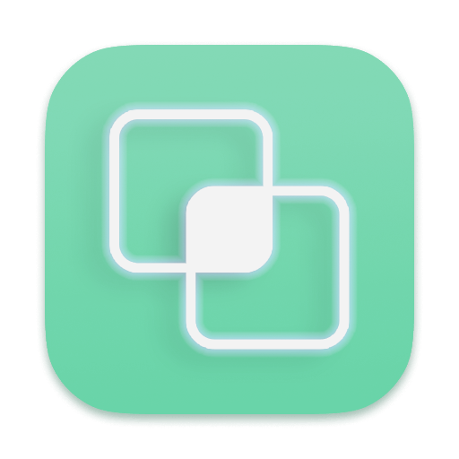
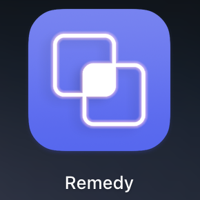
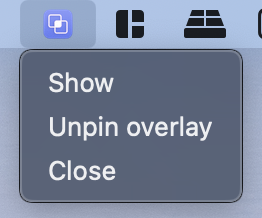

<h1 align="center">
  
   
  Remedy Standard
   
   
</h1>

# Usage  

## 1. Installation  

  

Download the .dmg from [release page](https://github.com/Naozumi520/Remedy/releases), open the .dmg file and drag the `Remedy Standard.app` to the Applications folder.  
  
## 2. Startup  

  

Double click "Remedy Standard" from your application list to open it. For some reasons this app is not signed yet. If you're not able to open the app, follow [this](https://support.apple.com/en-hk/guide/mac-help/mh40616/mac). If remedy run properly, you should able to see the Remedy icon appear in the menu bar and the discordStreamingKit windows pops up.  

## 4. Adjust and apply  
Adjust all the color options as you want then select the channel you're in or want to join for.  
Once you're done, press `control^ + enter` then to start the overlay.

# Questions

## How can I quit the overlay?  

  

After clicking the Remedy icon, there are few options in the menu bar:  
- `Show`:
  To display the discordStreamingKit page if it was hided or closed.  
- `Unpin overlay / Pin overlay`:
  Unpin or pin the overlay. Click to unpin the overlay and drag it where you want it to show. Press it again (Pin overlay) to pin the overlay and save the position. The position can be retained even if you restart remedy.
- `Close`:
  To quit remedy.

## Can overlay override a fullscreen app?  
Yes, Remedy overlay can override maximized and fullscreen apps.
